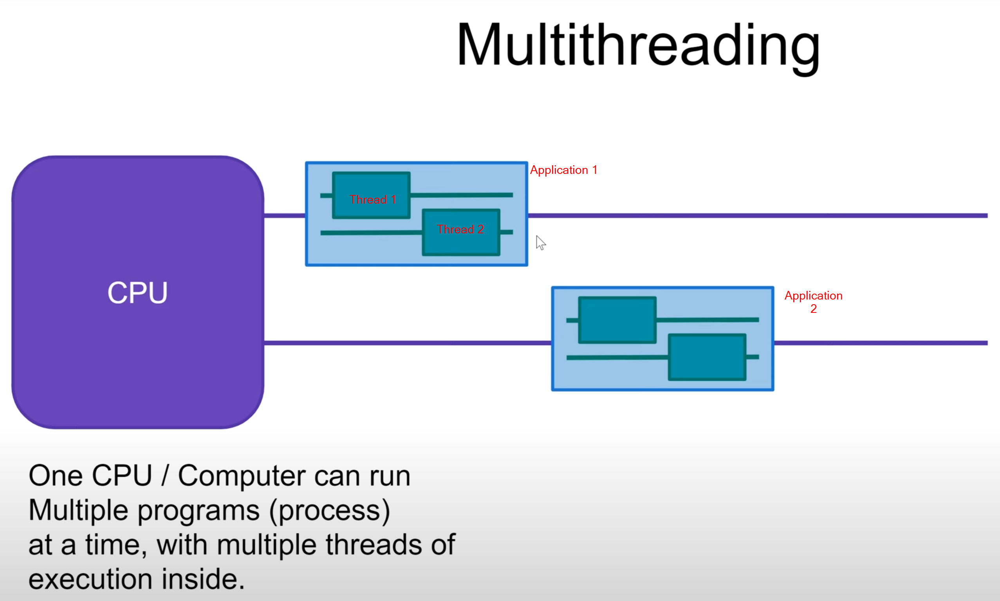
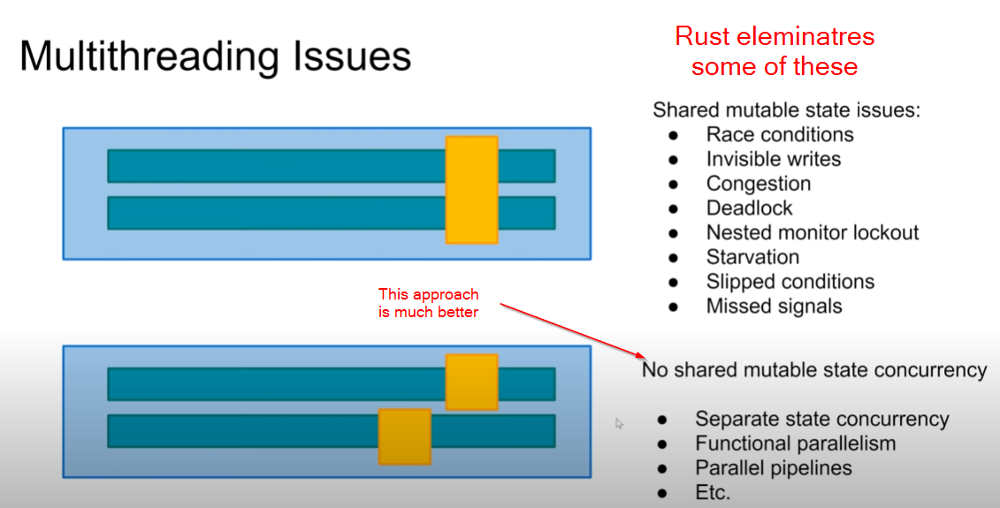
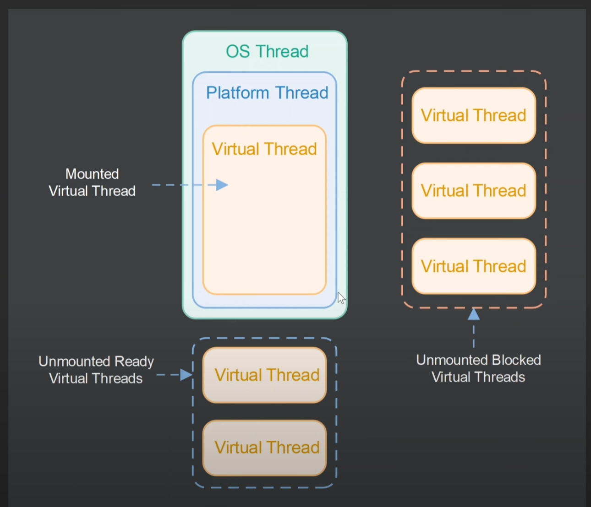
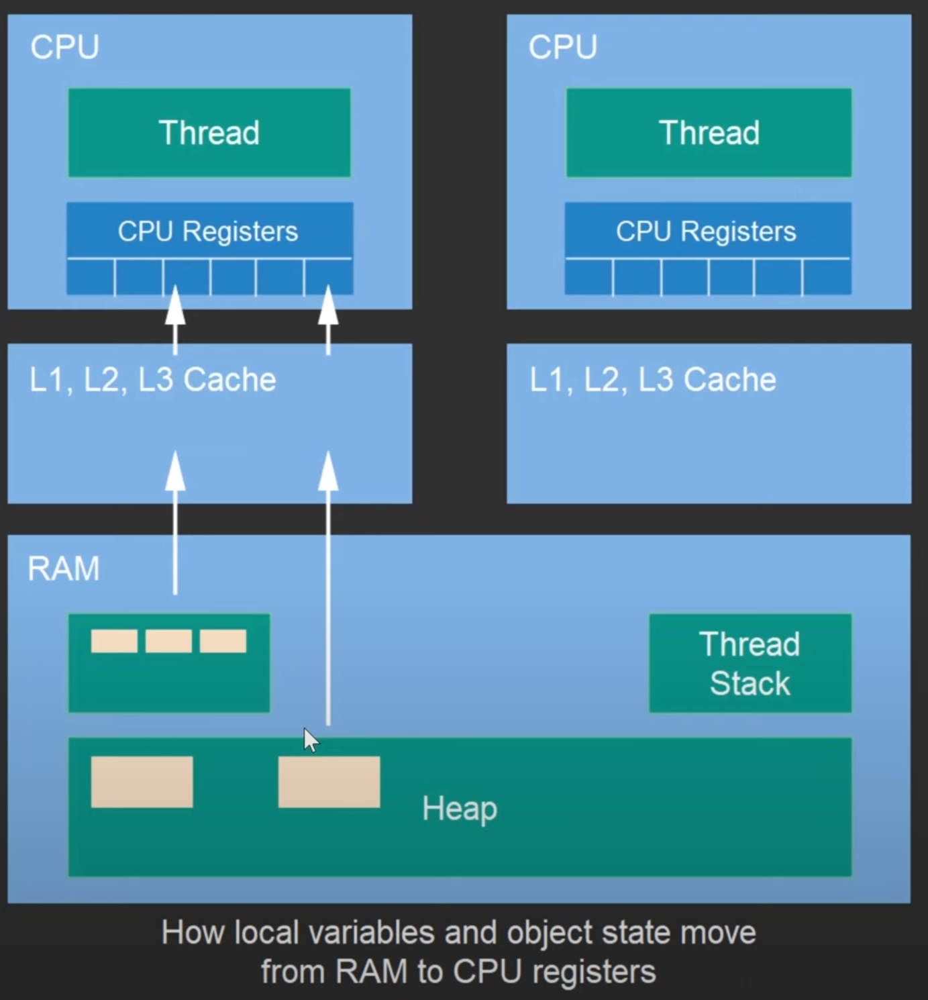
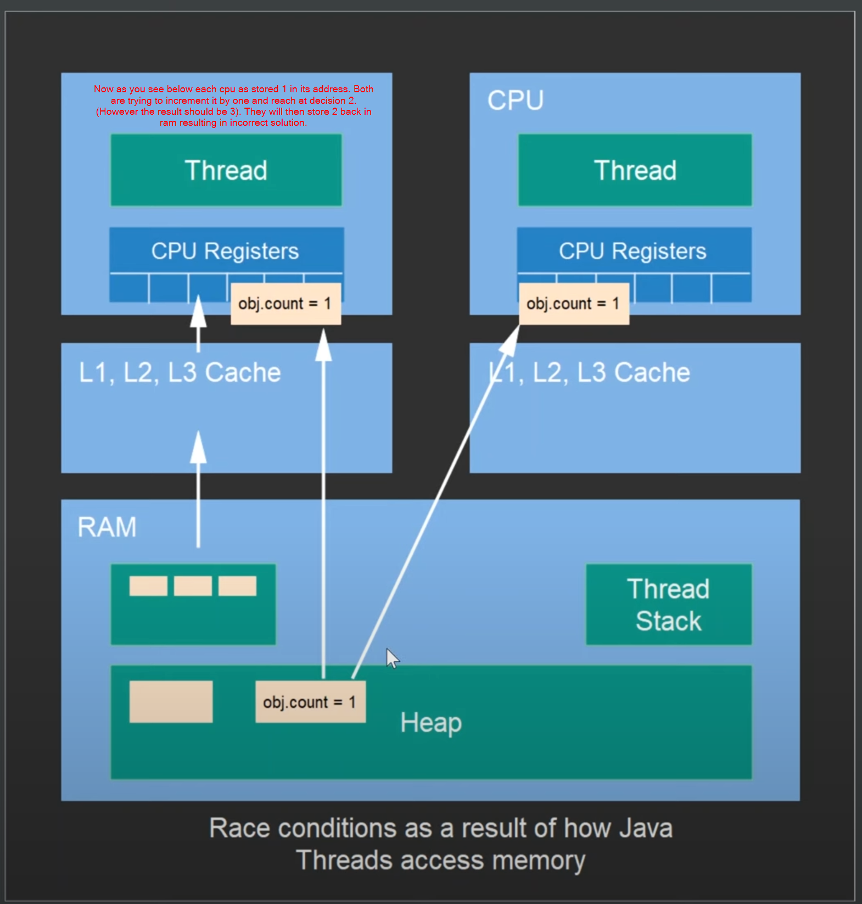
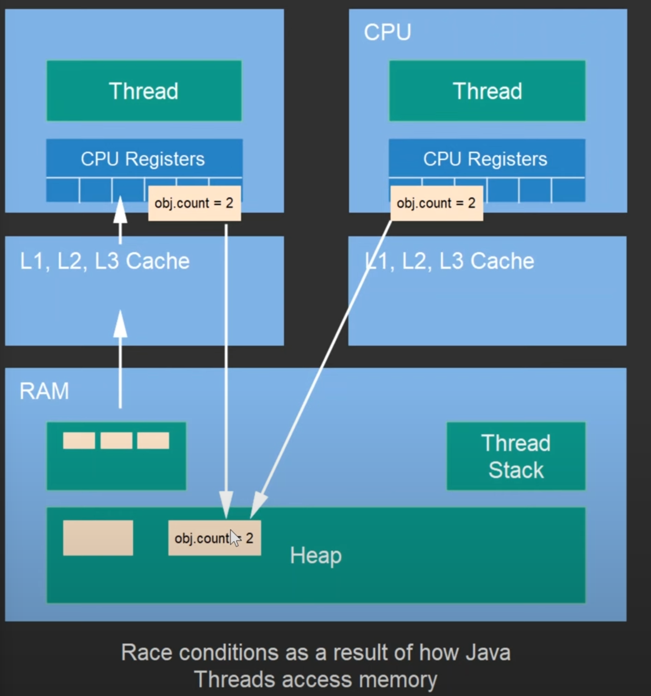
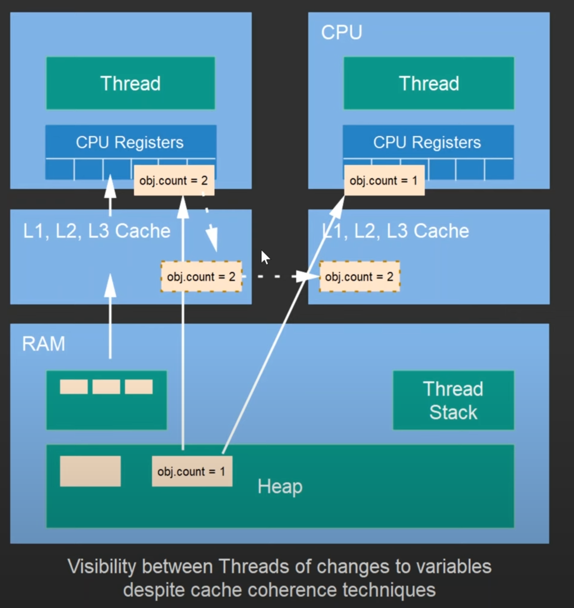

:toc: left

= Treading and Concurrency

- 1 CPU can exceute only 1 application at a time.
- CPU can round robin between application appearing that many tasks are being executed at the same time. (Actually the OS switches the task)
- Multithreading : 1 application can have number of threads and cpu can again round robin between those threads.

- Modern computers have multiple CPU's or multiple cores at least. So some applications might be running in parallel (at the same time) on different cores.
- It may also happen that under 1 application 1 thread is running on core-1 and other thread is running on core-2. Thus a single application has multiple threads running at the same time on different cores.

Multithreading can cause many types of issues. Below picture summarizes some of them.

== Diff ways to create and run threads

=== Extend Thread

[source,java]
----
class Threader extends Thread{
    public void run(){
        System.out.println("Running in a thread!!");
    }
}

public class ThreadExample {
    public static void main(String[] args) {

        Threader threader = new Threader();
        threader.start();

    }
}
----

=== Implement runnable (recommended)

[source,java]
----
class Threader implements Runnable{
    @Override
    public void run(){
        System.out.println("Running in a thread!!");
    }
}

public class ThreadExample {
    public static void main(String[] args) {

        Thread thread = new Thread( new Threader()); // thread gets a new runnable
        thread.start();

    }
}
----

You can also implement the `runnable` interface as a anonymus class.

[source,java]
----
public class ThreadExample {
    public static void main(String[] args) {

        Runnable runnable = new Runnable() {
            @Override
            public void run() {
                System.out.println("Running in a thread");
            }
        };

        Thread thread = new Thread( runnable );
        thread.start();

    }
}
----

Or even as a lambda.

[source,java]
----
public class ThreadExample {
    public static void main(String[] args) {

        Runnable runnable = () -> System.out.println("Running in a thread");

        Thread thread = new Thread( runnable );
        thread.start();

    }
}
----

== Thread programming basics

__Getting thread properties__

[source,java]
----
public class ThreadExample {
    public static void main(String[] args) {

        Runnable runnable = () -> {
            System.out.println("Running in a thread");
            System.out.println("Threads name is " + Thread.currentThread().getName());
        };

        Thread thread = new Thread( runnable , "Thread1" ); // passing thread name
        thread.start();

    }
}
----

__Starting multiple threads__

[source,java]
----
Thread thread1 = new Thread( runnable , "Thread1" );
thread1.start();
Thread thread2 = new Thread( runnable , "Thread2" );
thread2.start();
----

__Making a thread sleep__

[source,java]
----
public class ThreadExample {
    public static void main(String[] args) {

        Runnable runnable = () -> {
            System.out.println("Running in a thread");
            System.out.println("Threads name is " + Thread.currentThread().getName());
            try {
                Thread.sleep(1000); // sleep for 1000 milli sec
            } catch (InterruptedException e) {
                e.printStackTrace();
            }
        };

        Thread thread1 = new Thread( runnable , "Thread1" );
        thread1.start();
        Thread thread2 = new Thread( runnable , "Thread2" );
        thread2.start();

    }
}
----

Below is above programs output. As you see thread 2 was executed before thread 1. There is no guarantee that which thread will be executed first.

[source]
----
Running in a thread
Running in a thread
Threads name is Thread2
Threads name is Thread1
----

__Stopping a thread__

Basically you have to manage stopping a thread yourself. You can create a flag in your class `boolean stopRequested`.

If the stop is requested you can use the below code to stop the tread from doing anything.

[source]
----
while(stopReqeusted){
    Thread.sleep(1000);
}
----

You can use `synchronized` methods to update the value of the `stopRequested` flag. More on `synchronized` later down the page.

- Even if the `main` thread or the `main` function is stopped and there is another thread running the JVM will be up.
- In case you do not want any thread to run after the main thread is finished the thread should be marked as a daemon thread.
- Note that daemon thread may abruptly end when the main thread runs and thus cause behaviour which are not expected. Your code should make sure that the daemon threads are done and resting comfortably before you close out the main thread.

[source]
----
Thread thread1 = new Thread( runnable , "Thread1" );
thread1.setDaemon(true);  // marking thread as daemon thread
----

__Marking a thread to wait for another thread__ 

Consider the example below. The main thread will almost start and end immidiately triggering Thread1. But because Thread1 is a daemon thread it will end with main thread thus nothing will get printed.

[source,java]
----
public class ThreadExample {
    public static void main(String[] args) {

        Runnable runnable = () -> {
            for (int i=1; i<=5; i++){
                System.out.println("running ...");
                try {
                    Thread.sleep(1000);
                } catch (InterruptedException e) {
                    e.printStackTrace();
                }
            }
        };

        Thread thread1 = new Thread( runnable , "Thread1" );
        thread1.setDaemon(true);
        thread1.start();
    }
}
----

We can ask the main thread to wait for Thread1 before it ends.

[source,java]
----
public class ThreadExample {
    public static void main(String[] args) {

        Runnable runnable = () -> {
            for (int i=1; i<=5; i++){
                System.out.println("running ...");
                try {
                    Thread.sleep(1000);
                } catch (InterruptedException e) {
                    e.printStackTrace();
                }
            }
        };

        Thread thread1 = new Thread( runnable , "Thread1" );
        thread1.setDaemon(true);
        thread1.start();

        try {
            thread1.join();  // lets wait for thread1 to be completed before moving forward
            // main thread will wait here till thread1 is done.
        }catch (InterruptedException e){
            e.printStackTrace();
        }
    }
}
----

Example using threads : -> adding a graceful shutdown of the program.

[source,java]
----
public class ShutdownHook {
    public static void main(String[] args) throws InterruptedException {

        int a = 10;

        Thread mainThread = Thread.currentThread();

        Runnable r = () -> {
            try {
                mainThread.join();
            } catch (InterruptedException e) {
                e.printStackTrace();
            }
        };

        Thread graceFullShutdown = new Thread(r);
        Runtime.getRuntime().addShutdownHook(graceFullShutdown);

        Thread.sleep(10000);
        System.out.println("Finished gracefully");

    }
}
----

== Virtual Threads
- Java 19 introduces virtual threads as a preview feature.
- The traditional threads will be called Platform threads.
- The JVM will auto create some Platform Threads and keep them handy to execute virtual threads when they are created.
- The platform thread will execute virtual threads
- When the virtual thread gets blocked the platform thread will pick up some other virtual thread which is ready to be executed.
- Reference - Project LOOM
- This will utilize the platform thread much more efficiently.
- Virtual threads are much more light weight than platform threads.

[source,java]
----
Thread vThread = Thread.ofVirtual().start(runnable); // start virtual thread

// joining virtual thread -> same as platform thread.
vThread.join();
----

]

== Memory Model

Each Java thread is a heavy thread (maps of OS thread). Each OS thread needs 1MB to 2MB stack. So usually you should not create thousands of threads. (This will all possibly change with project Loom but as of not this is the situation)

- Each thread has its own memory stack.
  - The stack has primitives such as int, float, etc...
  - The stack has reference to things stored on the heap. (Note each thread will have its own reference to the same object stored on heap).
  - Some of the examples of things stored on heap are Strings, Objects etc...
  - Note the primitives e.g. `this.x` or `this.y` are for the instance or object. They will remain the same for that instance. E.g. if 2 threads get `this.x` for same instance they will be accessing the same variable.
  - If under an object there is a method which is using i to loop. Then it will be different for each instance.
  - Heap is common for the JVM and can be accessed by any thread stack.

[source,java]
----
for (int i=0; i<=10; i++)){ // diff for each thread
    this.count++; // shared between threads because its not a local variable
        }
----

[source,java]
----
for (int i=0; i<=10; i++)){ // diff for each thread
    this.count++; // shared between threads because its not a local variable
}

MyObj myobj = new MyObj(); // this is a local variable for each thread thus will be created under each thread. (Stored in heap referenced in stack)
----

Java's memory representation laid out on top of hardware is shown below.

Not all times the data moves to CPU registeres to be executed, sometimes it is also executed on Lx caches.

__Race conditions__

Race conditions arise when two threads access and modify the same data shared on the heap.

Ways to solve that in java (more on this later ...)
- synchronized blocks
- volatile variables 

- Also JVM has no control on when CRU will write back the data from its cache to RAM, so even if the operation has already taken place in CPU1 the CPU2 can pick up stale data from the ram for its operations.

- Some cpu's have cache coherirance strategy (copy from cpu1 to cpu2 cache without going via ram) but 
this too does not gaurentee any safety, reduces the problem though.

